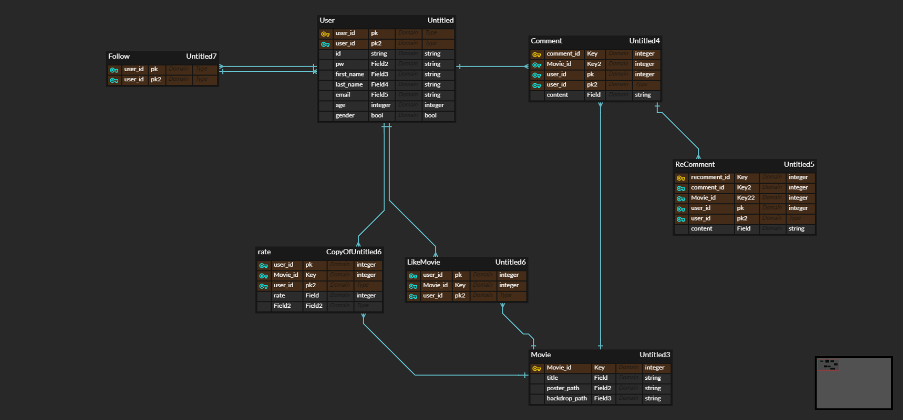

# Sinbak Movie


> TMDB API와 YOUTUBE API를 활용한 신박한 **영화 정보 제공** 및 **커뮤니티 사이트**입니다.

<br/>


## Goal

- Django와 Vue.js로 풀스택 개발을 할 수 있다.
- 외부 API를 사용할 수 있다.
- `CORS`와 `simple jwt`로 서버-클라이언트 통신과 로그인 기능을 구현할 수 있다.
- SPA의 한계점을 보완하고자, `vue-router` 를 이용하여 사용자로 하여금 url이 이동된 것 처럼 보이게 하며, 뒤로 가기를 지원한다.
- RESTful한 url을 구성할 수 있고, 다양한 method로 `axios` 요청을 보낼 수 있다.

<br/>


## Preview


<br/>


## Architecture 

| Django                                                       | Vue.js                                                       |
| ------------------------------------------------------------ | ------------------------------------------------------------ |
| django rest framework<br />image-kit<br />simple jwt<br />django cors headers<br />requests | vuex<br />vue-router<br />axios<br />vue-bootstrap<br />vue-fontawesome |

<br/>


## Roles

Back과 front를 분리하지 않았고, 초반 설계를 같이 진행했다.

| 박지수                                                       | 신동윤                                                       |
| ------------------------------------------------------------ | ------------------------------------------------------------ |
| <a href="https://github.com/parkjisu6239"></a> | <a href="https://github.com/Shin-dongyun"></a> |
| 영화 메인, 디테일 프론트 디자인<br />영화 추천<br />영화 검색 | 영화 커뮤니티 디자인<br />backend에서 model 수정<br />Modal  |

<br/>


## Implementation rate

추가로 아래와 같은 기능을 추가하려했으나, 

- 예상 별점
- 내 폴더 기능
- 성별 및 연령대별 별점 필터링

짧은 프로젝트 기간으로 인해, 주요기능에 충실하고자 했다.

<br/>


## ERD



**User와 movie** 두 개의 모델을 중심으로 Comment, RatedMovie, LikedMovie 등을 1:N 또는 M:N으로 모델링했다. 

<br/>


## 주요기능

### 1. 메인페이지


#### 🛠기능

- **검색**기능
- 가장 인기 많은 영화의 **트레일러**
- **인기영화**, **현재 상영작**, **이번 주 인기작** 정보 제공
- 화면에 존재하는 포스터를 클릭하면 모두 **디테일 페이지로 이동**


#### 🖍 디자인

- Navbar 아래에 tmdb의 backdrop_path를 통한 **그라데이션 백그라운드**

- 마우스 **hover에 반응**형으로 제작.
- **Hooper swiper**를 이용해 **마우스 클릭 또는 드래그**로 다양한 영화 정보를 한번에 제공.

<br/>


### 2. 디테일 페이지


#### 🛠기능

- **starating**를 통해 클릭 또는 드래그로 별점 매기기.

- 현재 우리 사이트에 가입한 유저가 매긴 **평점의 평균** 및 유저가 누른 **좋아요 수** 제공
- TMDB 사이트의 정보 제공 (배우 정보, TMDB 평점 및 투표수, overview 등)

- 하단에 현재 디테일 페이지 상의 영화와 **관련된 유사 영화 제공**
- `comment` 클릭 시, **댓글 페이지**로 이동 가능


#### 🖍 디자인

- starating을 사용하여, 별점 주기 편의성을 높임.
- 그라데이션 백그라운드
- bootstrap icon을 통해 알아보기 쉬운 아이콘 삽입.

<br/>


### 3. 댓글 페이지

디테일 페이지에서 `comment` 클릭 시, 베스트 댓글 모음 `modal` 등장

#### 1) 베스트 댓글


#### 🛠기능

- 디테일 페이지의 영화 댓글 중, 가장 좋아요가 많은 순서로 보여줌.
- 긴 댓글의 경우에 전부 보여주지 않음.
- `more comments` 버튼을 통해 댓글 상세 페이지로 이동 가능
- 좋아요 누르기 가능


#### 🖍 디자인

- vue-js-modal을 통해 쉽게 댓글 파악가능
- 작성자 옆에 프로필 사진 삽입
- boostrap icon 사용

<br/>


#### 2) 댓글 상세 페이지


#### 🛠기능

- 댓글 작성 버튼 클릭 시, 댓글 작성 modal이 발생하고 작성가능.
- 각 댓글에 대한 대댓글 작성 가능
- 자신이 단 댓글에 한해 삭제 및 수정 가능

- 각 유저가 매긴 별점이 존재할 시, 좌측 상단에 댓글 쓴 유저의 별점 제공.

<br/>


### 4. 추천 페이지

상단 navbar에서 `Recommendation` 클릭 시, 추천 페이지로 이동


#### 🛠기능

- 내가 최근에 좋아요를 누른 순서로 선택할 수 있는 화면 제공.
- 마음에 드는 영화 클릭 시, TMDB의 **recommendation**을 통해 영화 추천.
- 영화 클릭 시, 디테일 페이지로 이동.


#### 🖍 디자인

- 영화 포스터 hover 시, 팝업 기능.

<br/>


### 5. 검색


#### 🛠기능

- **상단 navbar의 search 창에 검색** 후, enter 또는 돋보기 버튼 클릭 시 검색 가능
- 맨위에 **검색 결과를 제공**
- 하단 similar movie에서는 **검색 결과와 관련된 영화를 제공**
- 포스터 클릭 시, 디테일로 이동.

<br/>


### 6. 프로필


#### 🛠기능

- 상단 우측, profile 버튼 클릭 시 이동가능
- 내 프로필에서는 설정버튼을, 다른 사람의 프로필에서는 팔로우 버튼을 제공
- 아래에 내가 좋아요와 평가한 영화 정보를 제공 클릭시 디테일 이동.
- 설정 클릭 시, 정보 수정 또는 탈퇴 선택.
- 탈퇴 클릭 시, 귀여운 경고 문구와 함께 탈퇴여부 선택

<br/>


### 7. 회원정보 수정


#### 🛠기능

- 회원정보 조회 및 수정 가능
- 수정 버튼 클릭 시 수정 모드 진입
- 이미지 프로필도 수정가능하며, 업로드를 하지 않을 시 기본 이미지 제공.
- 또한 `여기` 클릭 시 비밀번호 변경가능하며, 정보 오류 시 경고 문구.

<br/>


### 8. admin


#### 🛠기능

- 관리자 계정으로 로그인 시 우측 상단에 admin 태그 노출.
- 클릭 시 admin 페이지로 이동.

<br/>


##  client

**vuex**

- vuex 사용 시 비동기적 처리에서 어려웠으며, 지역적으로 사용할 경우에는 component 내에서 method와 state를 정의하는 게 훨씬 좋았다.
- state를 다시 computed에 넣어서 관리할 경우, 데이터의 동작시기가 달라 예상치 못한 에러가 발생했다.
- `v-if` 등으로 데이터가 존재할 때에만 동작하도록 하여 에러를 해결했다.
- vuex에서도 프로젝트의 규모가 커지면서 모듈로 나누어 관리용이성을 증가시켰다.


**axios**

- axios의 default 값(intercept, baseurl)을 변경했을 때,  모든 axios에서 적용이 되어서 원하는 결과를 얻지 못했다. 
- 그래서 이후, axios 요청마다 따로 header 또는 URL를 지정하여 해결하였다.
- get의 경우 2번째 인자로 header를 받고, post, put 등은 3번째 인자로 header를 받았는데 전부 두번째에 넣어서 오류가 발생했다.
- 즉 헤더가 아닌 payload로 보냈고, 이후 **Network** 탭에서 오류를 발견하고 수정하였다.


**라이브러리**

- 라이브러리 이용할 때 README가 부실하여 처음에 재대로 사용하기 어려웠다.
- 다양한 예제를 검색하고, 직접 node module 안에 있는 코드도 수정하며 우리가 사용하고자 하는 방향으로 이끌었다.
- vue-js-modal은 웬만하면 사용하지 말자!


**transition**

- 넷플릭스의 모달과 같은 효과를 주기 위해서, **transition**이라고 하는 css 구문 사용했다.
- 자연스럽게 요소가 선택되었다는 것을 보여줄 수 있다.


**UX**

- 유저에게 선택가능함을 알려주기 위해, 선택 가능한 요소에 대해 cursor를 pointer로 변경해주었다.
- 데이터를 서버나 API로부터 가져오는데 시간이 소요되기 때문에 로딩 페이지를 넣어 사용자가 그 시간을 인식할 수 있게끔 해주었다.
- modal를 통해 이동하지 않고도 수정과 작성이 가능하게 하였다.
- starating으로 손쉽게 별점을 줄 수 있도록 하였다.
- router 사용해서 URL만 변경함으로써 사용자에게 페이지를 이동했음을 인식시키고 히스토리 모드를 통해 뒤로가기가 가능하게 했다.


**router**

- router 전역 가드를 통해 로그인 시에만 서비스에 접근할 수 있도록 제한하였다.
- 비로그인 시에는 회원가입과 로그인 페이지만 갈 수 있도록 하였다.
- 동적 라우팅(query, params)을 이용해 URL 자체에 정보를 실었다. 


**localstorage**

- 로컬 스토리지에는 모든 것이 문자열로 저장된다.
- 만약 새로고침을 하더라도 정보가 필요할 시, 민감한 정보가 아니라면 로컬에 저장하자.


**파일 관리**

- 애초에 component를 생성할 때, 파일 구조를 잡아서 생성하도록 하자.
- 프로젝트 규모가 커지면 관리가 힘들다.


**Component**

- 만약 디테일 페이지에서 디테일 페이지로 넘어갈 경우에는`created`와 같은 life cycle hook이 작동하지 않는다.
- 이럴 때에는, 동적 라우팅을 이용하여 watch로 `$route` 를 감시하여 변경 사항을 적용한다.
- style의 경우에도 computed를 활용할 수 있다.

<br/>


## server

- 모델 설계를 잘하자!!! 나중에 수정하려면 front-end도 모두 수정해야할 수도 있다.

**Model**

```python
from django.db import models
from django.conf import settings
from django.db.models.fields import CharField

User = settings.AUTH_USER_MODEL

class Movie(models.Model):
    tmdb_id = models.CharField(max_length=50, unique=True)
    title = models.CharField(max_length=100, null=True)
    poster_path = models.CharField(max_length=200, null=True)
    backdrop_path = models.CharField(max_length=200, null=True)
    like_users = models.ManyToManyField(User, related_name='like_movies')


class Comment(models.Model):
    like_users = models.ManyToManyField(User, related_name='like_comments')
    user = models.ForeignKey(User, on_delete=models.CASCADE)
    movie = models.ForeignKey(Movie, on_delete=models.CASCADE, related_name='comments')
    content = models.CharField(max_length=1000)
    created_at = models.DateTimeField(auto_now_add=True)
    updated_at = models.DateTimeField(auto_now=True)


class ReComment(models.Model):
    user = models.ForeignKey(User, on_delete=models.CASCADE)
    comment = models.ForeignKey(Comment, on_delete=models.CASCADE, related_name='recomments')
    content = models.CharField(max_length=1000)
    created_at = models.DateTimeField(auto_now_add=True)
    updated_at = models.DateTimeField(auto_now=True)


class RatedMovie(models.Model):
    user = models.ForeignKey(User, on_delete=models.CASCADE, related_name='rated_movies')
    movie = models.ForeignKey(Movie, on_delete=models.CASCADE, related_name='rates')
    rate = models.IntegerField()
```


**URL**

```python
# movie_api/urls.py
from django.contrib import admin
from django.urls import path, include
from django.conf.urls.static import static
from django.conf import settings

from rest_framework_simplejwt.views import (
    TokenObtainPairView,
    # TokenRefreshView,
)

urlpatterns = [
    path('admin/', admin.site.urls), # GET admin 페이지
    path('api/v1/token/', TokenObtainPairView.as_view(), name='token_obtain_pair'), # POST 로그인 시 토큰 발행.
    path('api/v1/accounts/', include('accounts.urls')), # accounts
    path('api/v1/movies/', include('movies.urls')), # movies
] + static(settings.MEDIA_URL, document_root=settings.MEDIA_ROOT) # media 파일 저장을 위한 URL 및 root

```

```python
# movies/urls.py
from django.urls import path
from . import views
urlpatterns = [
    path('<int:tmdb_id>/comment/', views.comment_list_create), # GET POST comment 관련 정보 저장 및 조회
    path('<int:tmdb_id>/comment/<int:comment_id>/', views.comment_update_delete), # PUT DELETE 댓글 수정 및 삭제.
    path('<int:tmdb_id>/like/', views.movie_like,), # POST 영화 좋아요 수정 및 생성
    path('comments/<int:comment_id>/like/', views.comment_like,), # GET POST 댓글 좋아요 및 좋아요 조회
    path('<int:tmdb_id>/rate/', views.movie_rate), # GET POST 영화 평점 수정 및 생성
    path('<int:comment_id>/recomment/', views.recomment_list_create), # GET POST 대댓글 생성 및 조회
    path('<int:comment_id>/recomment/<int:recomment_id>/', views.recomment_delete), # DELETE 대댓글 삭제
    path('<int:tmdb_id>/like/rate/', views.get_like_rate), # GET 영화 좋아요 및 별점 조회
    path('<int:tmdb_id>/comments/best/', views.get_best_comment), # GET 베스트 댓글 조회
    path('<int:tmdb_id>/', views.set_initial_movie_info), # POST 영화 디테일 페이지 최초 진입 시에만 저장
    path('<int:tmdb_id>/backdrop/', views.get_backdrop), # GET 영화 뒷배경 가져오기.
]
```

```python
# accounts/urls.py
from django.urls import path
from . import views

urlpatterns = [
    path('signup/', views.signup), # POST 회원가입
    path('users/', views.user_update_delete), # GET PUT DELETE 유저 회원정보 수정 및 삭제 그리고 조회
    path('password-change/', views.user_password_change), # PUT 비밀번호 변경
    path('<username>/follow/', views.follow), # GET POST 유저 팔로우 정보 조회 및 수정
    path('issuperuser/', views.is_superuser), # GET 슈퍼 유저인지 판별.
    path('<username>/user/movies/', views.user_movie_info), # GET 유저의 rated movie & liked movie 정보 조회
]
```


**serializers**

- 이번 프로젝트에서 가장 많이 쓴 serializer method
- `get_<field_name>`으로 작성 시, 새로운 필드를 serializer 추가 가능 

```python
class CommentListSerializer(serializers.ModelSerializer):
    username = serializers.SerializerMethodField()
    
    # 이건 read_only
    # get_<field_name>으로 메서드 생성
    # self => instance, obj => Model
    def get_username(self, obj):
        return obj.user.username
    
    ...
    	fields=(...'username',) # 이렇게 추가.
```

<br/>


## Pin.

**지수**

- 동윤님과 함께 하면서 즐거웠다.
- 원래는 백엔드만 생각했었는데, 프론트도 하다보니 흥미가 생겨서 이 분야도 고려해봐야겠다.


**동윤**

- 지수님과 함께 하면서, css와 디자인에 대해 많이 배울 수 있었다.
- 프로젝트 기간이 정말 짧고 힘들었지만, 같이 하다보니 재밌게 잘 끝낼 수 있었다.
- 앞으로의 세번의 프로젝트도 잘 끝내고 싶다.
